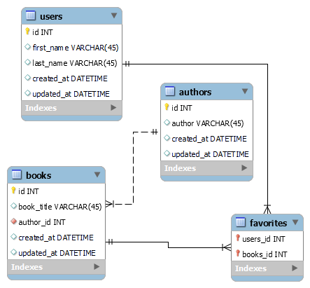

# Books

by Israel Diaz
 
## Assignment

Consider the following "flat" file that a start-up has just started using for its first customers: [Client's Original File](https://docs.google.com/spreadsheets/d/1uVH2ETvkVxQecG7N4jnbprVnTTlmuZfmY6jQVFkv9V0/gviz/tq?tqx=out:csv&sheet=Customers_favorite_books). They quickly realized that saving this information in .csv format will not meet their needs as they grow. First, consider how you would design a relational database to meet their needs. Be sure to consider conventions of normalization and what information should be separated.

## ERD.

To see the full solution go to the notebook. 